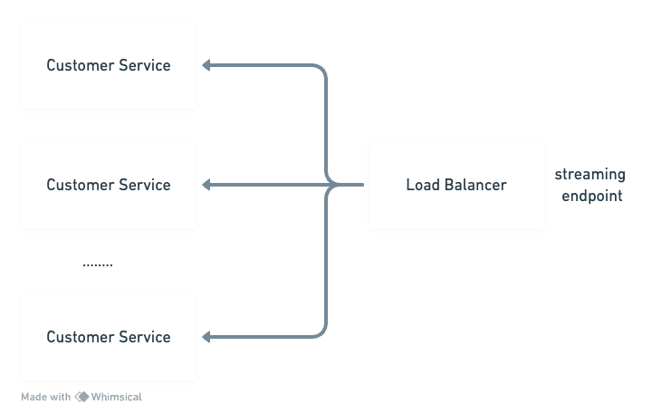

# Tracking App Design

In addressing the imperative task of facilitating live driver tracking, we're establishing two fundamental services. The foremost, the driver service, shoulders the responsibility of transmitting their location at regular intervals.

When deliberating upon the driver service, two distinct options emerge, each with its distinct advantages and considerations.

The initial approach involves leveraging a unary protocol. This method adheres to the core requirement: drivers simply need to transmit their locations without necessitating a streaming protocol from their end. This approach offers an attractive scalability proposition owing to its seamless horizontal scaling capabilities. However, it poses the challenge of escalated Request-Per-Second (RPS). Imagine a scenario where a single driver transmits their location to the server every second during an hour-long drive—resulting in a substantial 3600 API hits within that hour. Extrapolate this across numerous drivers, and the cumulative load becomes significant.

Contrastingly, the second option entails employing a streaming approach for drivers. This mechanism reduces the need for multiple requests by facilitating continuous transmission for the duration of a driver's journey to various locations. While this conserves server resources, managing a streaming API can be intricate and scaling it might pose challenges, though not insurmountable.

Following careful consideration, the initial choice advocates for the unary protocol for driver location transmission. Although presenting challenges related to increased RPS, this approach stands out due to its inherent scalability potential, allowing for straightforward horizontal scaling. However, it's essential to continually reassess and adapt our approach to best serve evolving needs.

In summary, the unary protocol serves as the starting point, offering scalability opportunities despite the challenge of heightened RPS, and it remains pivotal to our continuous assessment of the system's performance and adaptability.

To efficiently handle the substantial volume of data relayed by drivers to the consumer, the driver data will be directed to a message queue. This strategic implementation is twofold: it facilitates the seamless transfer of large volumes of driver data while ensuring reliable reception by our designated consumer service—referred to here as the customer service. Leveraging a message queue is instrumental in guaranteeing the consistent and orderly delivery of driver data to the intended consumer service. This ensures robustness and reliability in the data transmission process, essential for maintaining the integrity and effectiveness of our tracking system.

Customer service, within the context of our system, assumes a pivotal role in handling and dispatching incoming messages to the client in real-time. Given the imperative need for immediate data delivery, we've opted for the utilization of a streaming protocol.

Addressing concerns about scalability, a proposed strategy involves the establishment of a dedicated 'location topic.' This topic serves as a centralized hub, attracting multiple instances of customer service that subscribe to it.

To ensure seamless message dissemination and guarantee uniform reception across all consumers, each customer service instance subscribes to this topic using distinct groups. This approach assures that every consumer receives identical messages, fostering a synchronized and consistent real-time data delivery mechanism.

The customer service undertakes the crucial responsibility of managing its client connections while ensuring the comprehensive delivery of driver locations to all clients.

The primary objective here is twofold: first, to effectively handle the connections of clients that remain connected to the customer service, and second, to ensure the seamless distribution of all driver location data to every connected client."

When considering the scalability concerns associated with the customer service, implementing a load balancer emerges as a strategic solution. The introduction of a load balancer serves as a prudent measure to address scalability challenges effectively.

By incorporating a load balancer into the architecture of the customer service, we ensure a balanced and optimized distribution of incoming requests across multiple instances. This not only enhances the service's ability to manage and handle client connections efficiently but also lays the groundwork for seamless scalability as the system grows in both size and complexity.

